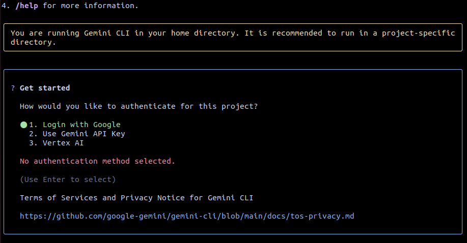
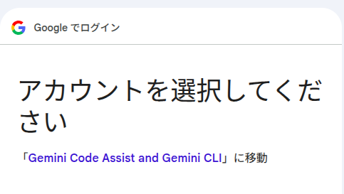
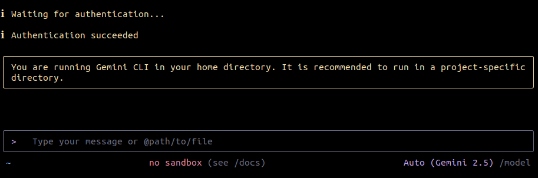

# Node.js と Gemini CLI のインストール

## Node.js
公式サイトからダウンロード
* [Node.js — Node.js®をダウンロードする](https://nodejs.org/ja/download)

---

## Gemini CLI
公式リポジトリからインストール
* [GitHub - google-gemini/gemini-cli: An open-source AI agent that brings the power of Gemini directly into your terminal.](https://github.com/google-gemini/gemini-cli)

### npmでグローバルにインストール
```bash
npm install -g @google/gemini-cli
```

> **チョットカシコク：**
> インストール方法には `npx` もあるが、`npx` は一時的にリポジトリをクローンしてくるようなもの。そのため、shellを閉じると消えてしまいます。
> 対して、`npm` はPC自体にインストールするので永久的です。

### 起動確認
`gemini` と打つだけで起動します。
```bash
gemini
```

---

## 初回認証
以下は初回起動時にGoogleアカウントを紐付ける方法です。
方向キーで選択、Enterキーで選択を確定します。

`Login with Google` を選択し、確定



任意のアカウントを選択
> **！！注意！！**
> **仕事用アカウントだと自動課金が発生するので、必ず個人用アカウントでお願いします。**



→認証が成功すると以下のような画面になり、Gemini（AIエージェント）との対話を開始できます。


