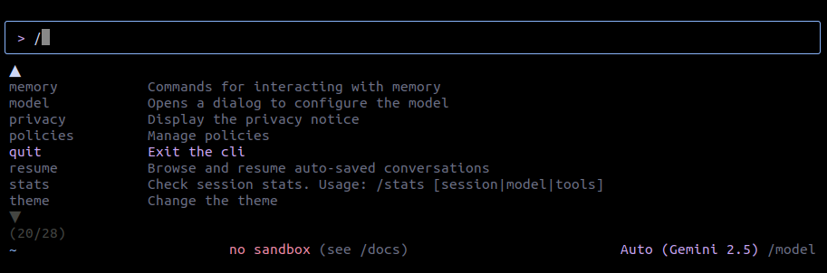
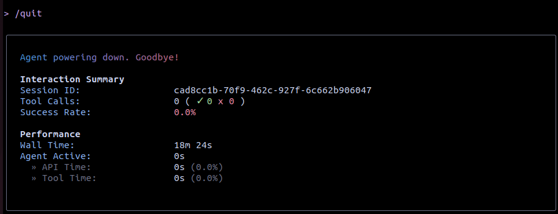

# Gemini CLI チュートリアル

## 起動方法
作業したいワークスペースのルートにいることを推奨します。
```bash
cd ~/file_pass
```

`gemini` と打つだけで起動します。
```bash
gemini
```

---

## 終了方法
「`/`」と打つと選択肢が表示されます。
「`quit`」を選択することで終了することができます。



なお、ターミナル自体を「`x`」で閉じることでも終了することが可能ですが、「`quit`」で閉じると以下のように、嬉しい情報（使用時間、トークン数など）を見ることができます。



---

## プロンプト例
> 日本語でお願いします。`<file>` を実行し、`<someting>` をしたいと考えています。実行中にエラーが出たら教えてください。また、エラーの解決をお願いします。
