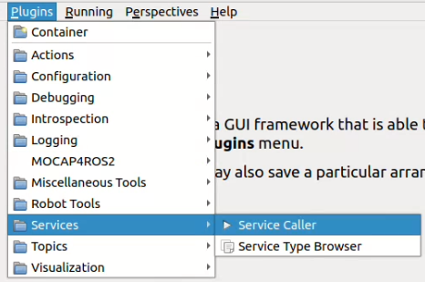
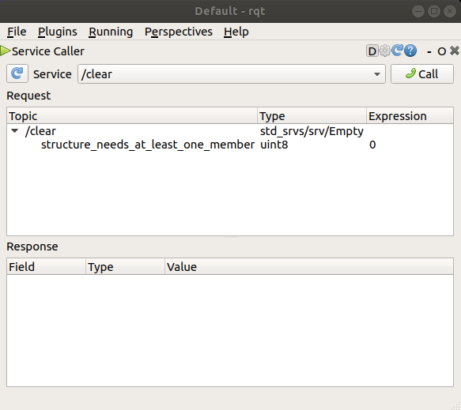
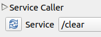
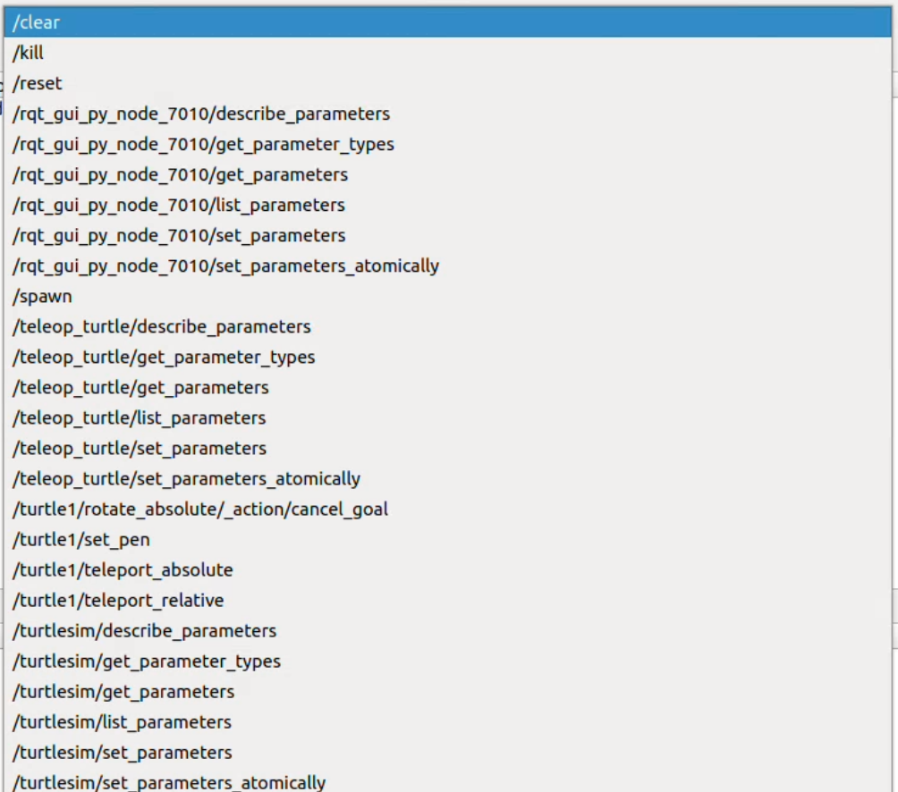
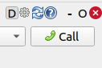
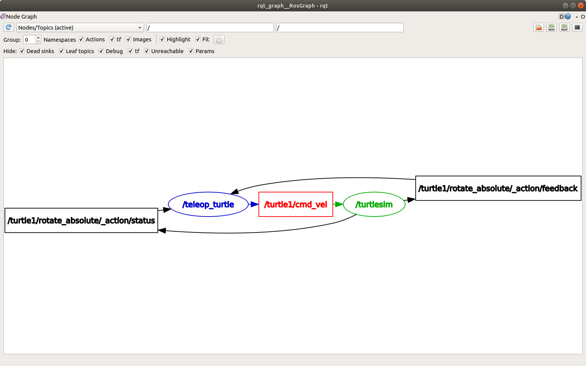
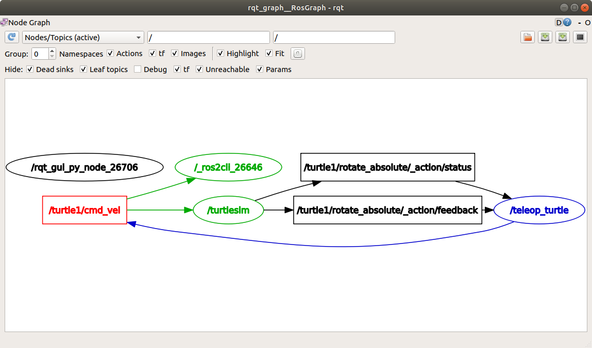
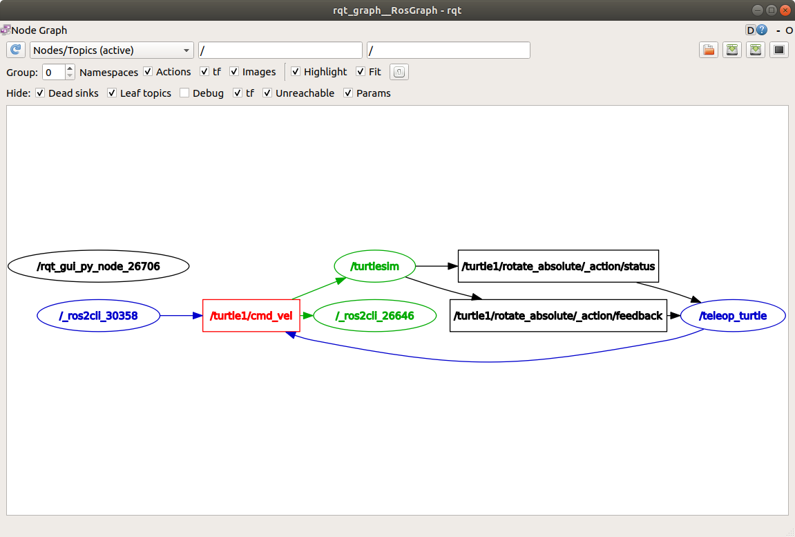
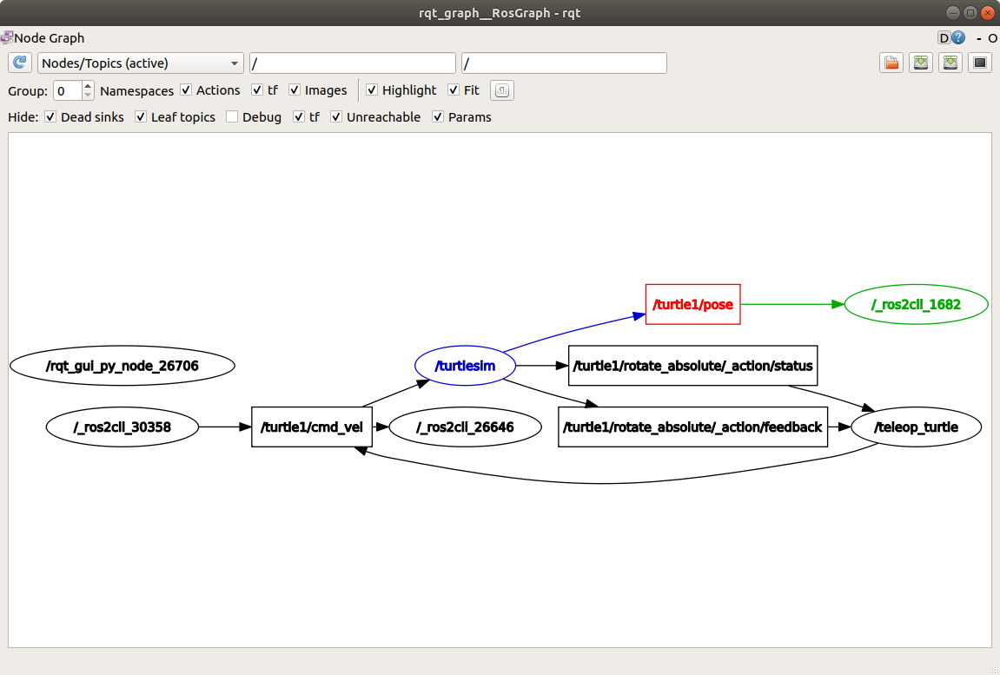

rqt は、ROS 2 のグラフィカル ユーザー インターフェイス (GUI) ツールです。rqt で実行されるすべての操作はコマンドラインで実行できますが、rqt は ROS 2 の要素を操作するためのよりユーザーフレンドリーな方法を提供します。
rqtの学習ツールとして、まずは軽量シミュレーターturtlesim環境をセットアップしましょう。
turtlesim は、ROS 2 を学習するための軽量シミュレーターです。ROS 2 の最も基本的な動作を説明し、後で実際のロボットやロボットシミュレーションで何を行うかについてのアイデアを提供します。
turtlesimパッケージはros_tutorialsリポジトリhttps://github.com/ros/ros_tutorials/tree/humble/turtlesimにあります。
turtlesimのインストール


ROS ディストリビューション用の turtlesim パッケージをインストールします。

```bash
sudo apt update
sudo apt install ros-<distro>-turtlesim
```


turtlesimの起動
turtlesim を起動するには、ターミナルに次のコマンドを入力します。
```bash
ros2 run turtlesim turtlesim_node
```

コマンドの下に、ノードからのメッセージが表示されます。デフォルトのタートルの名前と、そのタートルがスポーンする座標が表示されます。
シミュレーター ウィンドウが表示され、中央にランダムなタートルが表示されます。
turtlesimのテレオペ
最初のノードのタートルを制御するための新しいノードを実行します。
```bash
ros2 run turtlesim turtle_teleop_key
```

キーボードの矢印キーを使ってタートルを操作します。タートルは画面上を動き回り、付属の「ペン」を使ってこれまでの軌跡を描きます。
rqtプラグインのインストール

```bash
sudo apt update
sudo apt install '~nros-<distro>-rqt*'
```

rqtの起動
```bash
rqt
```

rqtを使用してturtlesimサービスのいくつかを呼び出し、操作します。
rqtを初めて実行すると、ウィンドウは空白になります。心配ありません。上部のメニューバーから
Plugins > Services > Service Caller を選択してください。


rqt がすべてのプラグインを見つけるまで時間がかかる場合があります。 「プラグイン」をクリックしても「サービス」やその他のオプションが表示されない場合は、rqt を閉じてターミナルにコマンドを入力してください。
```bash
rqt --force-discover
```


サービスドロップダウンリストの左側にある更新ボタンを使用して、ノードのすべてのサービスが利用可能であることを確認します。


「サービス」ドロップダウン リストをクリックして、turtlesimのサービスを確認し、任意サービスを選択します。


rqt を使ってサービスを呼び出してみましょう。


rqt ウィンドウの右上にある[Call]ボタンをクリックしてサービスを呼び出す必要があります。
rqt のサービスリストを更新すると、新しいサービスも表示されるようになります。
rqt_graphの起動
rqt_graphを使用して、変化するノードとトピック、およびそれらの間の接続を視覚化します。
```bash
ros2 run rqt_graph rqt_graph
```

または、 rqt開いてPlugins > Introspection > Node Graph を選択することで、 rqt_graph を開くこともできます。


上記のノードとトピックに加え、グラフの周囲に2つのアクションが表示されます（今は無視しましょう）。
この例では、/turtlesimノードと/teleop_turtleノードがトピックを介してどのように通信しているかを示しています。/teleop_turtleノードは/turtle1/cmd_velトピックにデータ（タートルを動かすために入力したキーストローク）をパブリッシュし、/turtlesimノードはそのトピックをサブスクライブしてデータを受信します。
rqt_graph の強調表示機能は、多くのノードとトピックがさまざまな方法で接続された、より複雑なシステムを調べるときに非常に役立ちます。
ノードやトピックにカーソルを合わせると、上の画像のように色が強調表示されます。
任意のトピックが rqt_graph のどこにあるか分からない場合は、[非表示] の下のボックスをすべてチェック解除できます。
/teleop_turtleが/turtlesimトピックにデータを公開することがわかっているので、
 echo /turtle1/cmd_velを使用してそのトピックをイントロスペクトしてみましょう。
```bash
ros2 topic echo /turtle1/cmd_vel
```

次に、rqt_graph に戻り、[デバッグ]ボックスのチェックを外します。


/_ros2cli_26646 （番号は異なる場合があります）は、先ほど実行したechoコマンドによって作成されたノードです。これで、パブリッシャーがcmd_velトピックを介してデータをパブリッシュし、2つのサブスクライバーがトピックをサブスクライブしていることがわかります。
次のコマンドを使用して、コマンドラインから直接トピックにデータをパブリッシュできます。
```bash
ros2 topic pub /turtle1/cmd_vel geometry_msgs/msg/Twist "{linear: {x: 2.0, y: 0.0, z: 0.0}, angular: {x: 0.0, y: 0.0, z: 1.8}}"
```

rqt_graphを更新すると、状況がグラフィカルに確認できます。


パブリッシュノード/_ros2cli_30358 が/turtle1/cmd_velトピックにパブリッシュしている様子が確認でき、このトピックは現在、ros2トピックエコーノード/_ros2cli_26646 と/turtlesimノードの両方で受信されています。
最後に、poseトピックでechoを実行してrqt_graph を再確認できます。
```bash
ros2 topic echo /turtle1/pose
```

rqt_graphを更新すると、状況がグラフィカルに確認できます。


新しいノードがサブスクライブしているposeトピックにも/turtlesimノードがパブリッシュしていることがわかります。
