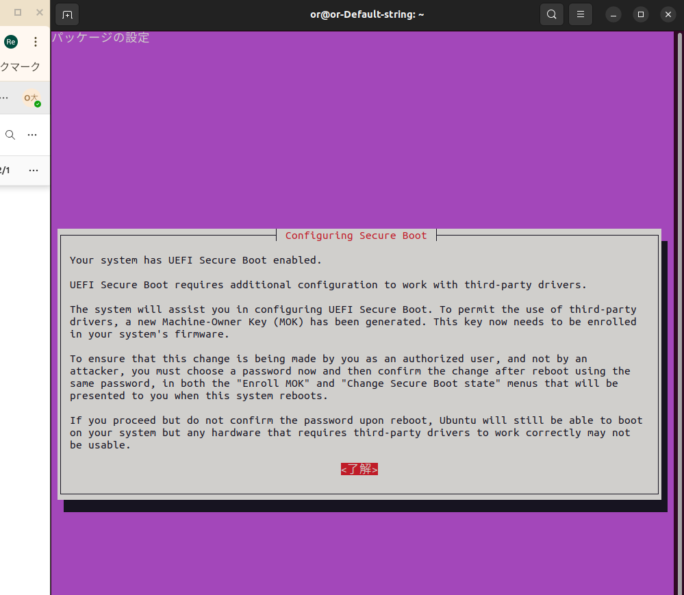
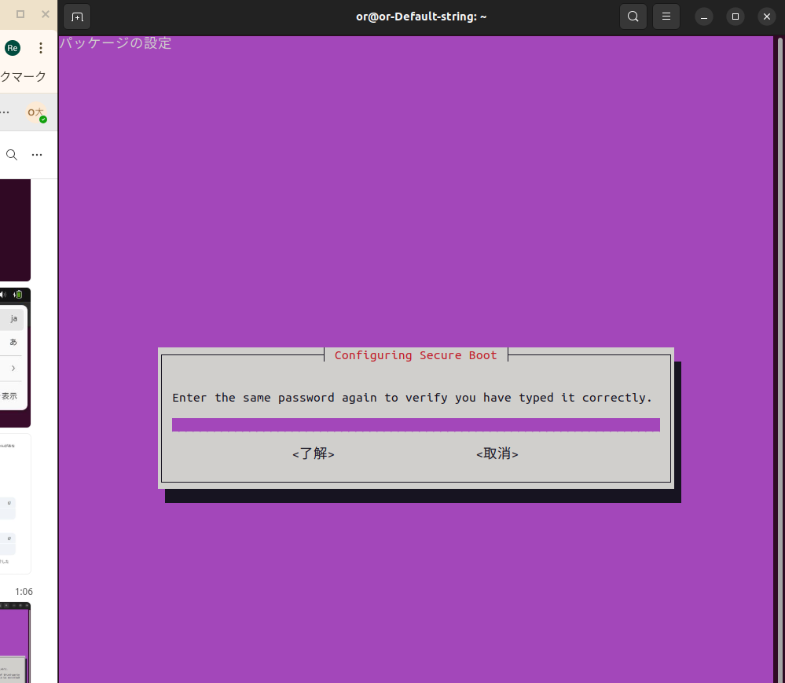
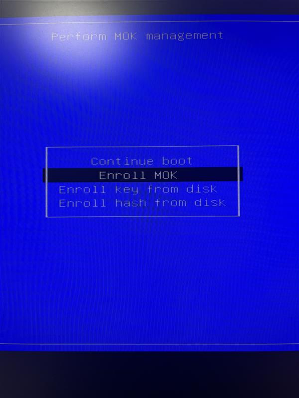
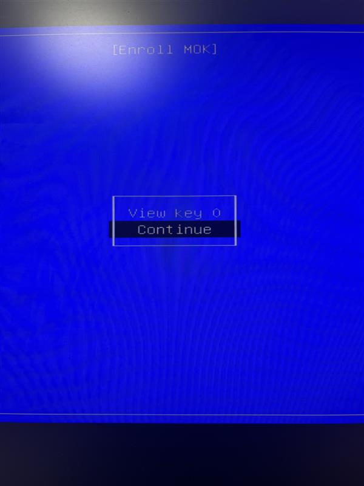
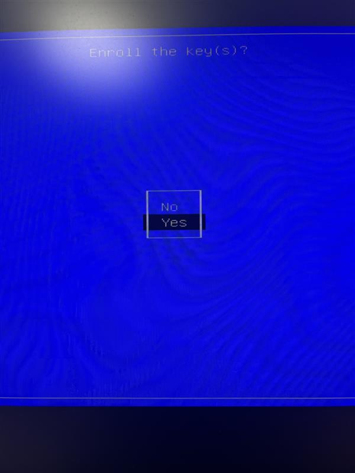
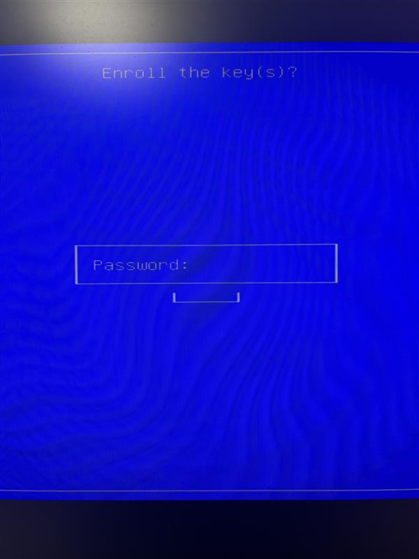
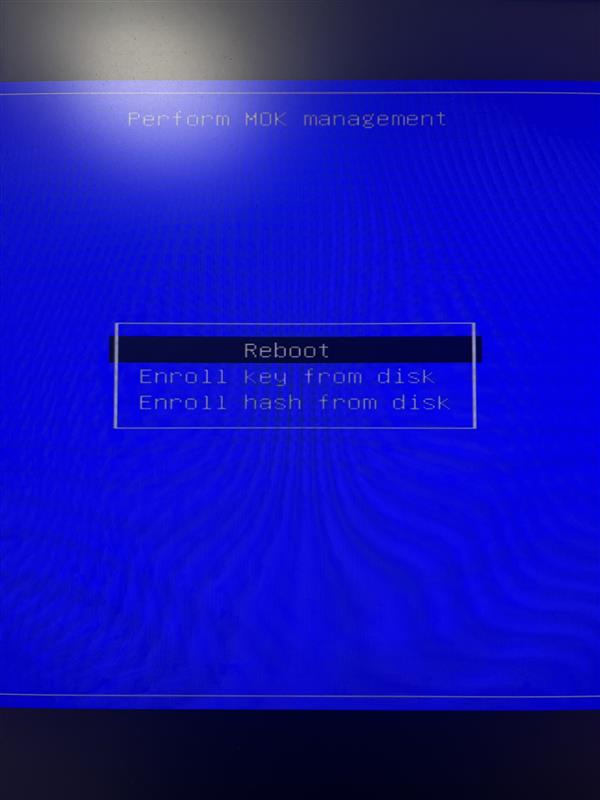

# NVIDIAデバイスドライバ

```bash
nvidia-smi

# 入ってなければ
ubuntu-drivers devices
```

**`<driver-name>`はrecommendのものを選ぶ**

---

了解（ENTER）



任意のパスワードを登録（忘れないで！！）し、了解
困ったら `12345678` でOK！

---



成功したら再起動
```bash
sudo reboot
```

---

## Enroll MOK



Continue



Yes



インストール時に登録したパスワードを入力
> **ここでパスワード忘れてたらがちでキレる　※前例あり**



Reboot



*画像提供者：大槻 玲弥（おおつき れいや）*

---

### **F11連打！！！！！！！！！！！！！！！**
> **絶対わすれるなよおおおおおおおおおおおおおお？！**

再起動後、もう一度確認
→ GPUの情報がでれば成功
```bash
nvidia-smi
```
